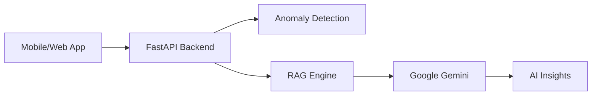

# Artha Sage - Personal AI Finance Assistant
Artha Sage is an AI-powered personal finance manager that transforms raw financial transactions into intelligent insights, predictions, and actionable financial guidance using Retrieval-Augmented Generation (RAG).

## 🚀 Overview
Modern finance apps show what you spent.
Artha Sage explains why you spent and what to do next.

The platform simulates real-world financial transactions and applies AI-driven analytics to help users:

- Understand spending behavior
- Detect unusual transactions
- Predict future expenses
- Receive personalized financial recommendations

## ✨ Key Features

### 📊 Unified Financial Dashboard
- Centralized transaction tracking
- Category-wise analytics
- Interactive charts & visual summaries

### 🤖 AI Expense Categorization
- Embedding-based similarity search
- Vector database retrieval
- RAG-powered classification using LLMs

### 🚨 Unusual Transaction Detection
- Statistical anomaly detection (±2.5σ deviation)
- Behavioral spending analysis

### 🧾 AI Financial Insights (Core Feature)
- Financial best-practice documents stored in Vector DB
- Context retrieval using RAG
- Personalized AI-generated recommendations

### 📈 Spending Prediction
- Time-based spending analysis
- Monthly expense forecasting

### 🔐 Secure User Experience
- JWT Authentication
- User-specific analytics and insights

## 🧠 What Makes Artha Sage Different (USP)
- ✅ **Explainable AI** — insights, not just numbers
- ✅ **RAG Architecture** — grounded AI recommendations
- ✅ **Hybrid Intelligence** — statistics + ML + LLM reasoning
- ✅ **Privacy-Friendly** — simulated financial ecosystem
- ✅ **Proactive Finance** — predicts and advises, not just tracks

## 🛠️ Technology Stack
- **Web Frontend:** Next.js 14+ (App Router), Tailwind CSS
- **Mobile App:** React Native (Expo)
- **Backend:** FastAPI (Python 3.10+)
- **AI Engine:** Google Gemini API (Flash/Pro) with RAG Pipeline
- **Statistics:** NumPy/SciPy for anomaly detection

## 🏗️ Architecture
The system follows a classic decoupled architecture with a focus on RAG (Retrieval-Augmented Generation).



## 🏁 Getting Started

### Prerequisites
- Node.js 18+
- Python 3.10+
- Gemini API Key

### Installation

1. **Clone the repository:**
   ```bash
   git clone https://github.com/codecaffin4346/Financemanager.git
   cd Financemanager
   ```

2. **Backend Setup:**
   ```bash
   cd backend
   pip install -r requirements.txt
   $env:GEMINI_API_KEY="your_api_key_here"  # Windows
   python -m uvicorn app.main:app --reload
   ```

3. **Web Frontend Setup:**
   ```bash
   cd ..
   npm install
   npm run dev
   ```

4. **Mobile App Setup:**
   ```bash
   cd mobile
   npm install
   npx expo start
   ```

## 🛡️ Security & Privacy
- **Local Context:** All insights are generated by providing transaction context to the LLM within a private prompt.
- **API Security:** API keys are managed via environment variables and never committed to version control.
